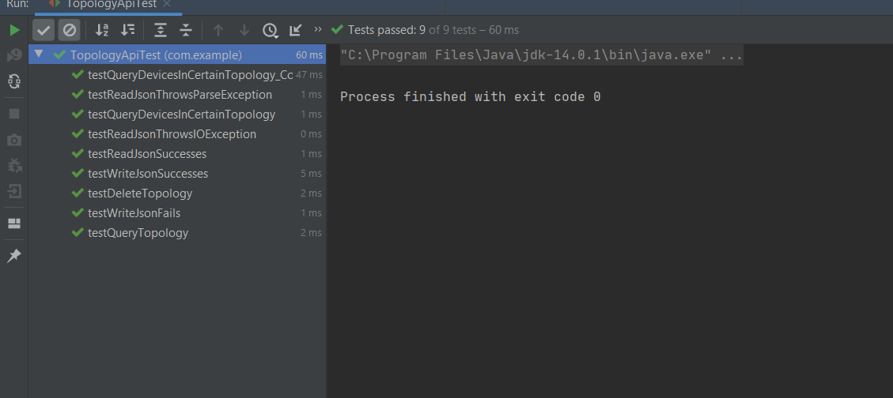

# MasterMicro_task2

## 📙About
A simple api is implemented to do some operations on topologies like
deletion , insertion ....., etc
## 🏁Getting Started
- You only need IDE to run this code like Vscode or Intellij but I prefer Intellij as it is simple when using java.
- I used Maven Dependency for building and javaDoc for documentation.
- Install java on your machine and add it to the environment variables.
- open the project and run the code.
## 💻Built Using
 - java as it is an object oriented programming and provides security 
   by reducing threats caused by an authorized access to memory    loactions and that does not happen in java as it avoids using    explicit pointers.
 - maven dependency
 - javaDoc for documentation
## Project structure
- Component class that is the super class for both of Resistor and     Nmos
- Api Interface that has the necessary methods that need to be   implemented
 - TopologyApi class that implements the api class.
 - Memory class which is nothing more than a list that stores    Topologies , and some static methods that do operation on memory
 - I added Memory class just for the sake of encapsulation.
 - Automated test is done for TopologyApi class in Test folder.
 - Documentation is done in documentation folder.
 - There is also a code that tests all the TopologyApi methods in the    main method in Main Class. 
## 📷Screenshots
### Automated Test for TopologyApi

### main method Test 

